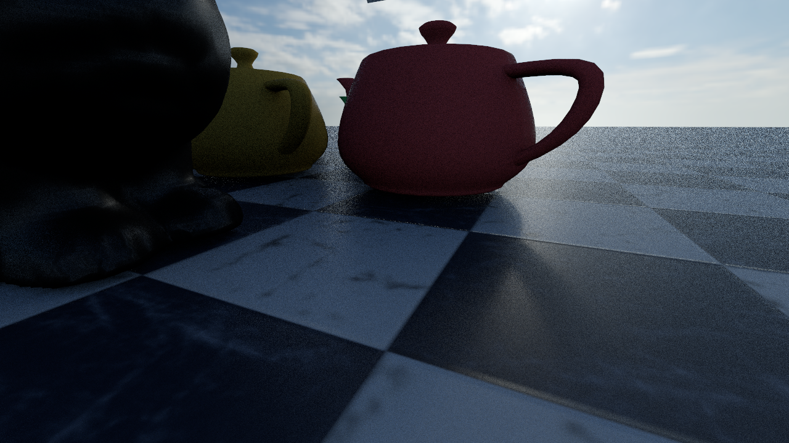
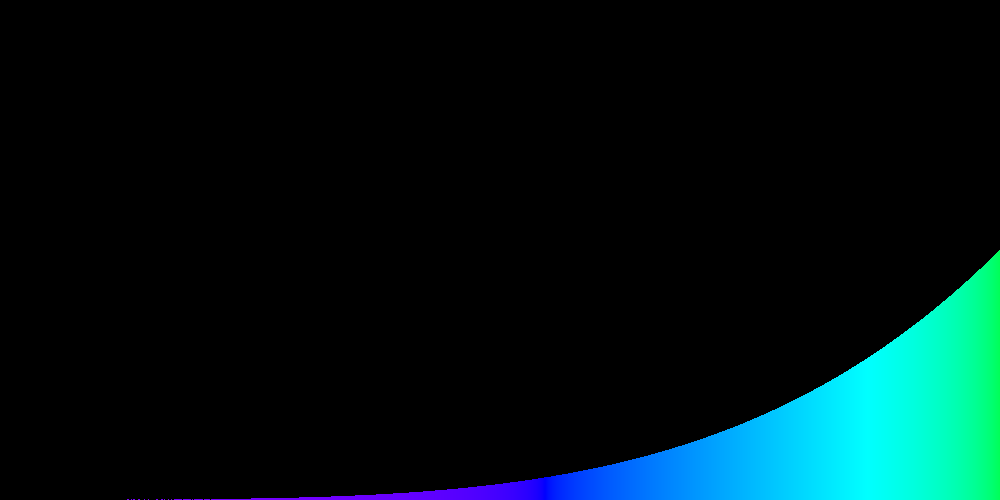
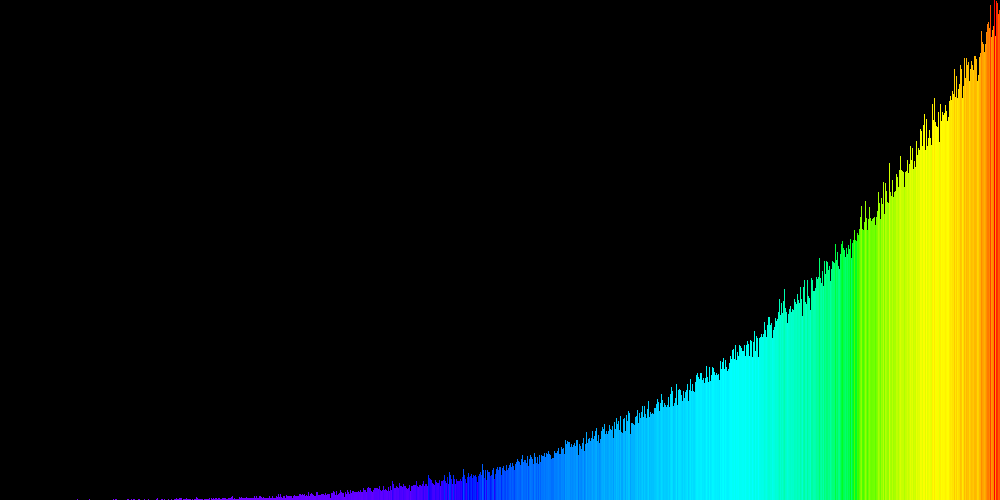
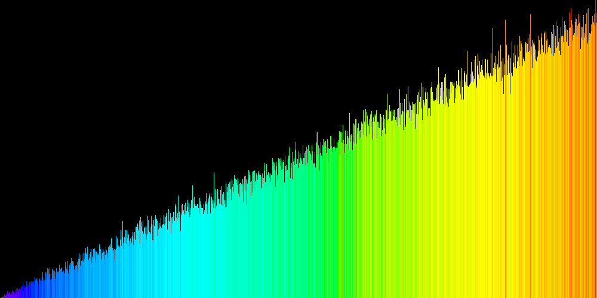
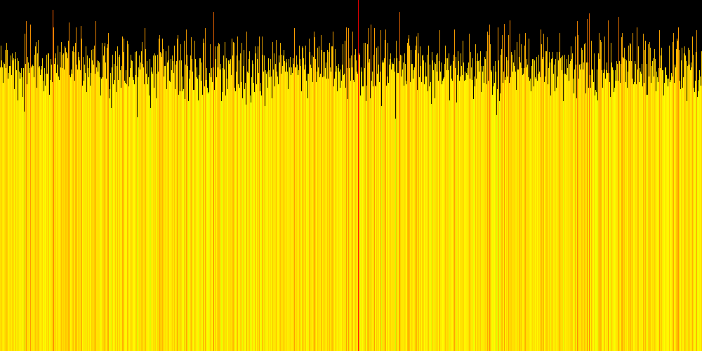
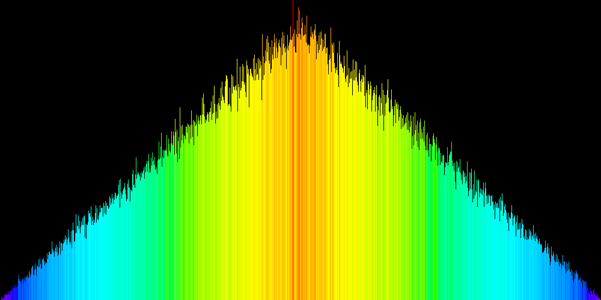
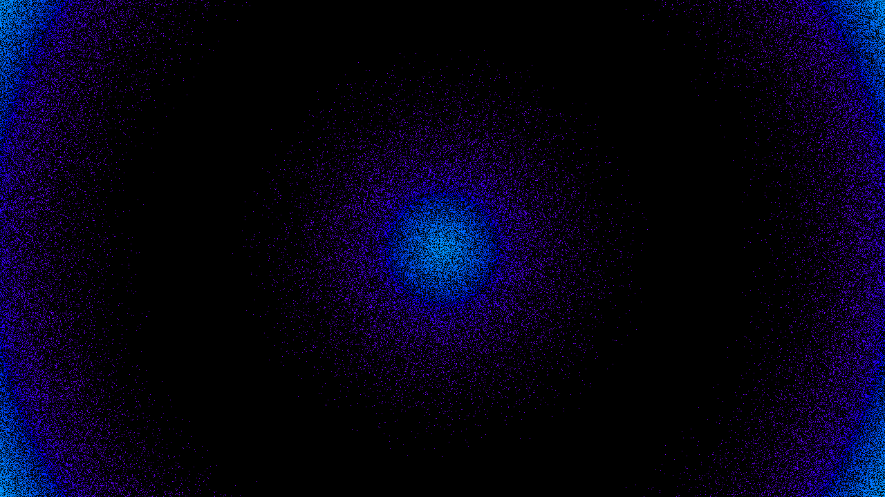
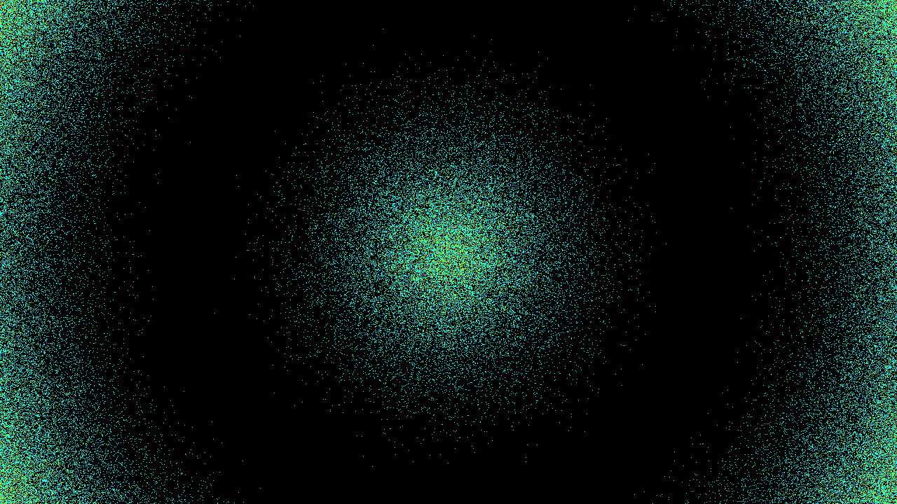
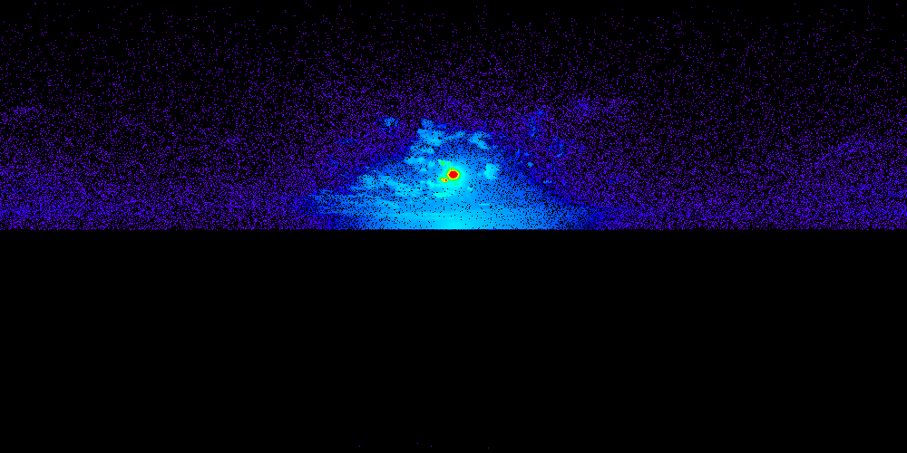
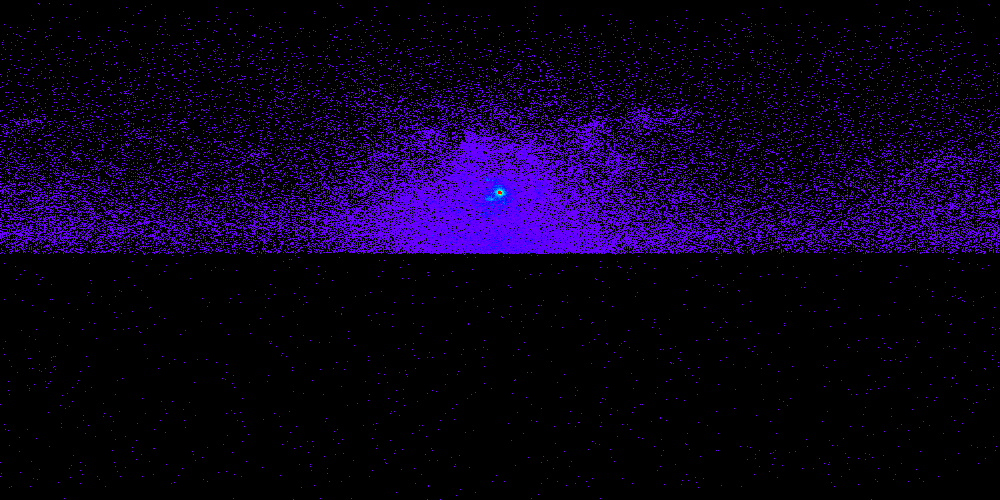

# Global Illumination – Enviornment map / Importance Sampling

Implementation of **Importance Sampling** for environment map lighting and discrete probability distributions as part of the Global Illumination course.

---

## Overview

This assignment implements efficient importance sampling techniques to improve rendering quality and reduce noise in Monte Carlo path tracing.

The following tasks were completed:

- ✅ 1D importance sampling
- ✅ 2D importance sampling
- ✅ Environment map sampling
- ✅ Marginal and conditional distributions
- ✅ Binary search inversion sampling
- ✅ Probability Density Function (PDF) evaluation
- ✅ Spherical distortion correction using **sin(θ)** weighting

---

## Features

### 1 – 1D Distribution Sampling

Implemented:

- Construction of cumulative distribution function (CDF)
- Continuous sampling (`sample_01`)
- Discrete sampling (`sample_index`)
- Binary search over the CDF
- PDF computation

---

###  2 – 2D Distribution Sampling

Implemented:

- Conditional distributions for each image row
- Marginal distribution over rows
- Continuous 2D sampling
- Correct probability density computation

---

###  3 – Environment Map Correction

Implemented spherical distortion correction for environment maps by multiplying each row with

```
sin(theta)
```

before constructing the 2D importance sampling distribution.

This compensates for the varying area represented by pixels near the poles of the spherical environment map.

---

## Rendering Results

### Uniform Sampling

The render below uses **uniform environment map sampling**.

It produces significantly more noise because samples are distributed uniformly across the HDR environment.



---

### Importance Sampling with Spherical Scaling

The render below uses **importance sampling** together with the spherical distortion correction.

Bright regions (such as the sun) receive more samples, reducing variance and producing a cleaner render.


---

## Rendering Comparison

| Uniform Sampling | Importance Sampling |
|------------------|---------------------|
|  |  |

---

# Debug Results

## 1D Power Distribution

| PDF | Sample Distribution |
|-----|---------------------|
|  |  |

---

## 1D Gradient Distribution

| PDF | Sample Distribution |
|-----|---------------------|
|  |  |

---

## 1D Constant Distribution

| PDF | Sample Distribution |
|-----|---------------------|
|  |  |

---

## 1D Absolute Distribution

| PDF | Sample Distribution |
|-----|---------------------|
|  |  |

---

## 2D Distribution (Circle)

| PDF | Sample Distribution |
|-----|---------------------|
|  |  |

---

## 2D Distribution (Environment Map)

| PDF | Sample Distribution |
|-----|---------------------|
|  |  |

---

## Build

```bash
cmake -S . -B build -G Ninja
cmake --build build --parallel
```

---

## Run

Render the example scenes using:

```bash
./gi configs/a03.json
```

Sunset environment:

```bash
./gi configs/a03_sunset.json
```

Sibenik cathedral:

```bash
./gi configs/a03_sibenik.json
```

---

## Repository Structure

```
configs/
data/
src/
dist1D_abs_hits.png
dist1D_abs_pdf.png
dist1D_const_hits.png
dist1D_const_pdf.png
dist1D_gradient_hits.png
dist1D_gradient_pdf.png
dist1D_pow_hits.png
dist1D_pow_pdf.png
dist2D_0_hits.png
dist2D_0_pdf.png
dist2D_1_hits.png
dist2D_1_pdf.png
output.png
sunset scalin.png
README.md
```

---

## Results

The implementation demonstrates the effectiveness of importance sampling:

- Reduced image noise
- Faster convergence
- Better sampling of bright regions in HDR environment maps
- Correct PDF evaluation for unbiased rendering
- Proper handling of spherical environment map distortion

---

## Author

**Shalu Shajan**

Master's Student  
Friedrich-Alexander-Universität Erlangen-Nürnberg (FAU)

---

## Acknowledgements

This project was completed as part of the **Global Illumination** course at FAU Erlangen-Nürnberg.
